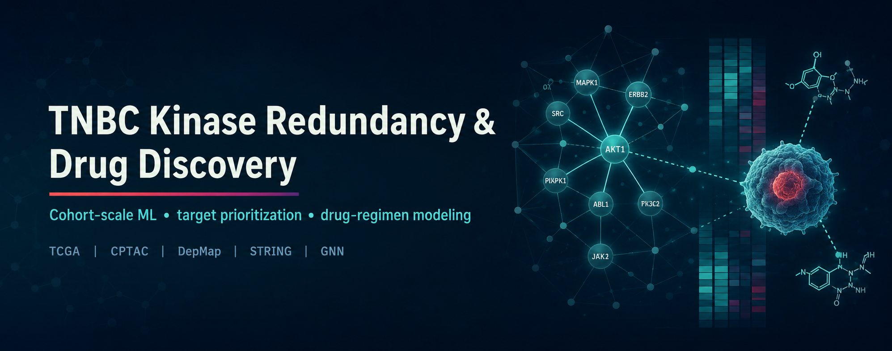

# TNBC Kinase-Redundancy, Drug-Regimen, and Cohort-Scale ML Project

[](LICENSE)
[](https://www.python.org/)
[](https://pytorch.org/)
[]()
[]()
[](https://doi.org/10.5281/zenodo.22282629)

A real-data computational pipeline for RTK/NRTK target prioritization and drug-regimen
discovery in triple-negative breast cancer. This repository consolidates our earlier
kinase-scoring and drug-regimen work into a single codebase, extended from a single
focal-patient case (TCGA-AO-A128) to four cohort-scale analysis tracks, a cohort-wide
HCOS evaluation (Track D), and a full robustness/ablation/null-model validation suite.


## Project scope

| Track | Question | Population | Status |
|---|---|---|---|
| A — Survival/prognosis | Patient-level risk prediction | Full BRCA cohort, n≈1000-1098, subtype as feature | Built and verified (`src/survival/patient_level_survival_model.py`) |
| B — Treatment response | Predict pCR/response | — | Not attempted — no response label available in this cohort; see `docs/limitations.md` |
| C — TNBC subtyping | Lehmann-style molecular subtypes | TNBC-only, n≈150-200 | Built and run on real data (1095 patients). Code correctness confirmed via synthetic ground truth, but real-cohort clustering gives consistently weak separation (silhouette 0.02-0.07) across three independently-designed methods. We interpret this as genuine TNBC subtype overlap in bulk RNA-seq rather than a code defect — see `docs/limitations.md` |
| D — Biomarker/drug-target discovery | Which kinases/regimens generalize across the cohort | TNBC-only, n≈150-200; cohort-wide HCOS n=59 | Built and verified end-to-end — `mdcoe.py` reproduces the HCOS = 0.450 headline result and wires into `cohort_wide_regimen_analysis.py` (see `src/regimen/README.md`). **Now also run across all 59 HCOS-eligible patients**, not just the focal case — see Cohort-Wide HCOS Evaluation below. |

`src/regimen/`, `src/scoring/`, and `src/data_loaders/` contain the real source code behind
these results, not placeholders — each folder's own README states exactly what has been
verified against real data and what still requires the raw TCGA/DepMap/STRING/DGIdb files
(see `data/README.md` for where to obtain them).

## Cohort-Wide HCOS Evaluation (n=59)

Beyond the single focal-patient demonstration (TCGA-AO-A128), HCOS/MDCOE was independently
re-run across every eligible PAM50 basal-like patient, using real MAF-derived mutation
data and real PAM50 subtype calls reconstructed from scratch:

- **192** PAM50 basal-like patients &rarr; **156** with &ge;1 protein-altering panel-gene
  mutation &rarr; **59** meeting the &ge;2 drug-mappable-gene eligibility threshold.
- **Note:** this 59-patient threshold uses MDCOE's own curated `GENE_DRUGS` mapping — a
  different (and independent) druggability source from the live-DGIdb-derived panel
  used for the manuscript's headline **18**-patient cohort. The two figures are not
  directly comparable; see the manuscript's Section 4.10 for the full distinction.
- The focal-patient result was reproduced **exactly** via this independent pipeline:
  `afatinib+alpelisib+trastuzumab` / `afatinib+capivasertib+trastuzumab`, both
  HCOS = 0.450.
- **25 distinct top-ranked regimens** across the 59 patients (real therapeutic
  heterogeneity, not a fixed recommendation).
- Recurring top-ranked drugs: `adavosertib` (49/59), `alpelisib` (16/59), `olaparib`
  (12/59). Recurring pathways: Cell Cycle Checkpoint (49/59), MAPK/ERK (31/59),
  PI3K/AKT (25/59), DNA Damage Repair (12/59).
- **58/59** patients carry a TP53 alteration — the dominant driver of `adavosertib`'s
  recurrence is a real, cohort-wide biological property of basal-like TNBC, not an
  artifact isolated to one patient.
- **21/59 patients (36%)** received a *negative* top-ranked HCOS score — evidence the
  framework does not artificially inflate weak candidates.

## Robustness, Ablation, and Null-Model Validation

A full methodological validation suite was run against the real, unmodified
`kinase_scoring_pipeline.py` functions and real CTS/PairCTS input data (STRING: 464
edges, 9 Louvain communities; DGIdb: 4,655 interaction records; FunMap: 3,081
panel-restricted edges, 77% density).

**Reproducibility.** Recomputing CTS from raw components reproduced all 90 published
kinase-level CTS values to floating-point precision (max diff 8×10⁻¹⁷). Recomputing
PairCTS reproduced the published top drug-pair result exactly (`adavosertib+defactinib`
&rarr; kinase pair `(PTK2, TYRO3)`, PairCTS=0.509657).

**Weight-perturbation robustness (1,000 random weight draws).** CTS: mean ρ=0.94,
median ρ=0.95, min ρ=0.78. PairCTS: mean ρ=0.91, median ρ=0.96, min ρ=0.57 (min top-20
overlap 15%). Five kinases (EGFR, ERBB2, IGF1R, KDR, PTK2) remained in the CTS top-20
across **all 1,000** trials; only two kinase pairs (ERBB2-EPHA2, EGFR-EPHA2) achieved
the same for PairCTS.

**Leave-one-component-out ablation.** For CTS, no single component's removal was
catastrophic (ρ range 0.81–0.94). For PairCTS, removing **complementarity** collapsed
the ranking (ρ=0.49, top-10 overlap 10%), while removing **crosstalk** barely changed
anything (ρ=0.98) — the Louvain-community complementarity term dominates PairCTS far
more than real STRING edge weights. This asymmetry was independently reproduced under
FunMap-substituted crosstalk (complementarity ρ=0.53, crosstalk ρ=0.96), confirming it
is a property of the scoring design, not an artifact of STRING's specific topology.

**LMTK2/LMTK3 exclusion (formal confirmation of the `docs/kinase_panel_audit` finding).**
Excluding both genes from the panel left every CTS and PairCTS ranking completely
unchanged (ρ=1.000000 exactly, top-10/20 overlap=1.000); neither gene was ever in the
original top-20. The panel audit's recommendation is confirmed empirically, not merely
assumed to be safe.

**Null-model testing (mixed results, reported without adjustment).** Three permutation
null models (1,000 permutations each) were compared against the observed top-ranked
score:

| Null model | Empirical p | Verdict |
|---|---|---|
| A: CTS value shuffle | 0.039 | Weak evidence against null |
| B: STRING network randomization | 0.935 | No evidence against null |
| B′: FunMap edge-weight shuffle (topology too dense for degree-preserving rewiring — 77% density) | 0.601 | No evidence against null, consistent direction |
| C: Drug-target mapping shuffle (real, 1,617-drug `dgidb_interactions.tsv`) | 0.998 | Observed score *below* 99.8% of null draws |

We do not claim CTS/PairCTS beat random expectation — two of three null models do not
support that claim, and the manuscript states this explicitly. The framework is instead
presented as a transparent, reproducible tool for **orthogonal evidence integration**,
not a validated efficacy predictor. Full methodology, figures, and interpretation:
manuscript Sections 4.11 and 5.7. Raw permutation outputs and per-kinase/per-pair
stability tables are archived under `results/tables/robustness_ablation_null/`.

## Subprojects in this repository

This repository contains several related but independently-developed efforts on TNBC
kinase redundancy and combination therapy. Each addresses a different angle, and nothing
here is cross-validated against the others except where explicitly noted in that
subproject's own docs.

- **`src/` + `data/`** — the CTS/HCOS/DepMap cohort-scale pipeline, the main focus of this
  README.
- **`tnbc-genomics-agent/`** — a self-contained, single-patient VCF-to-narrative pipeline
  (10-kinase curated database, redundancy/bypass-risk scoring, AI-assisted synthesis,
  companion report in `tnbc-genomics-agent/docs/`). Test suite passing (31/31).
- **`mc-ore-prototype/`** — a proposed extension of `tnbc-genomics-agent` (GNN synergy
  prediction, knowledge graph, multi-agent reasoning), with a runnable Phase-1 scaffold
  notebook. See `mc-ore-prototype/README.md` for a naming note (MC-ORE / Hybrid-CORE /
  CL-MODE are used across its source documents for the same concept).
- **`tnbc_regimen_pipeline/`** — an installable (v3.0.0) Python package: a matured,
  CLI-driven, provenance-stamped version of `src/regimen/` and `src/discovery/`'s scripts.
  A CLI run reproduces the headline afatinib+alpelisib+trastuzumab HCOS = 0.450 result to
  floating-point precision, and handles live-network failures (e.g. a PubMed E-utilities
  outage) by logging and excluding the affected gene rather than crashing. See
  `tnbc_regimen_pipeline/INTEGRATION_NOTES.md`.
- **`cptac-proteomics-validation/`** — real, measured CPTAC BRCA proteomics, cross-checked
  against STRING-predicted kinase crosstalk edges used in `PairCTS`/`TripletCTS`. This
  cohort is BRCA-wide rather than TNBC-restricted (151 samples) since no subtype metadata
  is available for it through the `cptac` package. See `cptac-proteomics-validation/README.md`.
- **`docs/kinase_panel_audit/`** — a cited kinase-panel audit (56 RTK + 32 NRTK = 88, vs.
  our original 54+29 = 83). This audit identified a real discrepancy: the 90-kinase panel
  used throughout this project includes `LMTK2`/`LMTK3`, which the audit recommends
  excluding. **This has since been formally tested** (see Robustness section above):
  excluding both genes changes no ranking at all — see `docs/limitations.md`.
- **`src/predictive_models/`** — GNN-based kinase-response/redundancy and drug-synergy
  prediction. The synergy component fulfills the gap `mc-ore-prototype/README.md` itself
  documents as not yet built (`SynergyModel.predict_pair()`, previously a placeholder
  interface awaiting DrugCombDB/AZ-DREAM-style training data). This module is implemented
  and synthetic-data-verified; real-data training (DrugComb, PRISM Repurposing) is in
  progress. See `src/predictive_models/README.md` for current status and known limitations
  (no biologics support yet, e.g. trastuzumab). Once this is validated on real data, we
  intend to retire `mc-ore-prototype`'s placeholder `SynergyModel` rather than maintain two
  parallel implementations.

`docs/source_repo_readmes/` preserves the original READMEs from the two GitHub repos this
project was consolidated from (`tnbc-kinase-scoring-pipeline`, `TNBC-drug-regimen-discovery`).

## Repository layout

```
tnbc-project/
├── tnbc-genomics-agent/      # separate subproject — own README + INTEGRATION_NOTES.md
├── mc-ore-prototype/          # separate subproject — proposed extension of tnbc-genomics-agent
├── tnbc_regimen_pipeline/     # separate subproject — installable package, verified end-to-end
├── src/predictive_models/     # GNN-based kinase-response and drug-synergy prediction
├── data/
│   ├── raw/            # real, externally-sourced data — see data/README.md for download
│   │                   # instructions per source (never hand-edited)
│   └── processed/      # code-generated intermediate files, regenerable from raw/
├── src/
│   ├── data_loaders/   # per-source loaders (TCGA, DepMap, STRING, DGIdb, openFDA, PubMed)
│   ├── scoring/        # CTS / PairCTS / TripletCTS, + robustness/ablation/null-model scripts
│   ├── regimen/        # MDCOE/HCOS beam search, cohort-wide regimen analysis (Track D)
│   ├── survival/       # per-kinase survival test + patient-level risk model (Track A)
│   ├── subtyping/      # TNBC molecular subtyping (Track C)
│   ├── ml/             # DepMap dependency-prediction ML investigation
│   └── discovery/      # agentic literature-mining pipeline
├── tests/              # mirrors src/, synthetic-data-with-known-structure smoke tests
├── notebooks/          # exploratory analysis
├── results/
│   ├── figures/
│   ├── tables/
│   │   └── robustness_ablation_null/  # weight-perturbation, ablation, null-model outputs
│   └── reports/        # findings reports
├── docs/                # methodology, data provenance, limitations
└── scripts/             # CLI entry points wiring loaders through to src/ modules
```



```mermaid
%%{init: {
  'theme': 'base',
  'themeVariables': {
    'primaryColor': '#ffffff',
    'primaryBorderColor': '#2B3A42',
    'lineColor': '#34495E',
    'fontSize': '14px',
    'fontFamily': 'arial, sans-serif'
  }
}}%%

flowchart TD
    %% Styling Classes
    classDef stageBox fill:#FAFAFA,stroke:#B0BEC5,stroke-width:2px;
    classDef inputNode fill:#EBF3FA,stroke:#3B7EA1,stroke-width:2px,color:#1C3D5A;
    classDef scoreNode fill:#FFF4E6,stroke:#E67E22,stroke-width:2px,color:#7E3D00;
    classDef comboNode fill:#EAF2E8,stroke:#2E7D32,stroke-width:2px,color:#1B4332;
    classDef hcosNode fill:#F3E5F5,stroke:#7B1FA2,stroke-width:2px,color:#4A148C;
    classDef validNode fill:#E0F7FA,stroke:#00838F,stroke-width:2px,color:#004D52;

    %% STAGE 1: DATA INTEGRATION & COHORT SCREENING
    subgraph S1 ["<b>STAGE 1: Data Integration & Cohort Screening</b> (§2.1, §2.6)"]
        direction TB
        subgraph S1_Inputs ["Multi-Omic & Bioinformatic Sources"]
            direction LR
            D1["<b>TCGA-BRCA Data</b><br/><i>RNA-seq, Clinical, Somatic Mutations</i>"]:::inputNode
            D2["<b>DepMap Portal</b><br/><i>CRISPR Essentiality (25 TNBC Lines)</i>"]:::inputNode
            D3["<b>STRING REST API</b><br/><i>PPI Network, Centrality, Communities</i>"]:::inputNode
            D4["<b>DGIdb GraphQL API</b><br/><i>4,655 Interaction Records</i>"]:::inputNode
            D5["<b>openFDA FAERS API</b><br/><i>Adverse Event Profiles</i>"]:::inputNode
        end

        CohortFunnel["<b>Cohort Screening Funnel</b><br/>&#9472;&#9472;&#9472;&#9472;&#9472;&#9472;&#9472;<br/>&#8226; Total TCGA-BRCA Subtyped: n = 1,087<br/>&#8226; PAM50 Basal-like: n = 192<br/>&#8226; Mutation Eligible: n = 168<br/>&#8226; Candidate Drug-Mapped (&#8805;2 Genes, DGIdb-restricted): n = 18<br/>&#8226; HCOS-Eligible (&#8805;2 genes, GENE_DRUGS): n = 59"]:::inputNode

        D1 --> CohortFunnel
    end

    %% STAGE 2: COMPOSITE TARGET SCORE ENGINE
    subgraph S2 ["<b>STAGE 2: Composite Target Score Engine</b> (§2.2)"]
        direction TB
        Panel["<b>90-Gene Kinase Panel</b><br/><i>56 RTKs + 34 NRTKs (LMTK2/LMTK3 exclusion confirmed inert)</i>"]:::scoreNode

        CTS_Calc["<b>Composite Target Score (CTS)</b><br/>CTS(k) = 0.30&#183;Centrality + 0.25&#183;Essentiality<br/>+ 0.25&#183;Survival + 0.20&#183;Druggability"]:::scoreNode

        TopKinases["<b>Cohort Kinase Prioritization</b><br/>&#9472;&#9472;&#9472;&#9472;&#9472;&#9472;&#9472;<br/>1. <b>ERBB2</b> (0.690)<br/>2. <b>EGFR</b> (0.613)<br/>3. <b>PTK2 / FAK</b> (0.532)"]:::scoreNode

        Panel --> CTS_Calc
        S1_Inputs --> CTS_Calc
        CTS_Calc --> TopKinases
    end

    %% STAGE 3: HIGHER-ORDER COMBINATION FRAMEWORK
    subgraph S3 ["<b>STAGE 3: Higher-Order Combination Framework</b> (§2.3&#8211;2.4)"]
        direction TB
        PairCTS["<b>PairCTS (Two-Drug Scoring)</b><br/>&#9472;&#9472;&#9472;&#9472;&#9472;&#9472;&#9472;<br/>&#8226; Target CTS (0.35 + 0.35)<br/>&#8226; Louvain Community Complementarity (0.20)<br/>&#8226; Edge Crosstalk (0.10)<br/><i>Dominated by complementarity, not crosstalk (&#961;=0.49 vs. 0.98 on ablation)</i>"]:::comboNode

        TripletCTS["<b>TripletCTS (Three-Drug Scoring)</b><br/>&#9472;&#9472;&#9472;&#9472;&#9472;&#9472;&#9472;<br/>&#8226; Module Coverage (0.30)<br/>&#8226; Escape-Route Closure (0.30)<br/>&#8226; Non-Redundancy (0.25)<br/>&#8226; Combined Toxicity (-0.15)"]:::comboNode

        TopKinases --> PairCTS
        PairCTS --> TripletCTS
    end

    %% STAGE 4: PATIENT-SPECIFIC PRIORITIZATION
    subgraph S4 ["<b>STAGE 4: Patient-Specific Prioritization</b> (§2.5, §4.3, §4.10)"]
        direction TB
        FocalPatient["<b>Focal Patient Selection</b><br/><i>TCGA-AO-A128 (PAM50 Basal-Like)</i><br/>Altered: EGFR, PTEN, FLT1, TP53, ERBB2, TYK2"]:::hcosNode

        HCOS_Engine["<b>MDCOE / HCOS Beam Search</b><br/>&#9472;&#9472;&#9472;&#9472;&#9472;&#9472;&#9472;<br/>HCOS = Synergy + Evidence + SizeBonus<br/>&#8722; 0.2&#183;ToxOverlap &#8722; 0.3&#183;DivPenalty"]:::hcosNode

        FocalOutput["<b>Top Patient Regimen (HCOS = 0.450, Tied)</b><br/>&#9472;&#9472;&#9472;&#9472;&#9472;&#9472;&#9472;<br/>1. Afatinib + Alpelisib + Trastuzumab<br/>2. Afatinib + Capivasertib + Trastuzumab"]:::hcosNode

        CohortOutput["<b>Cohort-Wide HCOS (n=59)</b><br/>&#9472;&#9472;&#9472;&#9472;&#9472;&#9472;&#9472;<br/>25 distinct top regimens<br/>58/59 TP53-altered<br/>21/59 negative top score"]:::hcosNode

        CohortFunnel -.-> FocalPatient
        FocalPatient --> HCOS_Engine
        D5 -.->|Toxicity Profiles| HCOS_Engine
        HCOS_Engine --> FocalOutput
        CohortFunnel -.-> CohortOutput
        HCOS_Engine -.-> CohortOutput
    end

    %% STAGE 5: INDEPENDENT VALIDATION & SENSITIVITY ANALYSES
    subgraph S5 ["<b>STAGE 5: Independent Validation &amp; Sensitivity</b> (&#167;4.5&#8211;4.7, &#167;4.11)"]
        direction TB
        DepMapVal["<b>DepMap Essentiality Assessment</b><br/>Gene-Identity (R&#178; = 0.337) vs.<br/>Per-Sample Model (R&#178; = -0.029)"]:::validNode

        CPTACVal["<b>CPTAC Proteomic Validation</b><br/>&#8226; 107/276 Significant Correlations<br/>&#8226; 44/107 Matched STRING Edges<br/>&#8226; Identifies ERBB3 &#8596; ABL1 Crosstalk"]:::validNode

        FunMapVal["<b>FunMap vs. STRING Evaluation</b><br/>&#8226; 13% Edge Overlap (394/3,151)<br/>&#8226; Median Rank Shift: 117 Positions<br/>&#8226; Elevates YES1, SYK, &amp; PKC Axis"]:::validNode

        ReproTest["<b>Reproducibility Audit</b><br/>Bit-identical HCOS = 0.450 across<br/>4 independent code paths + cohort-wide rerun"]:::validNode

        RobustTest["<b>Robustness/Ablation/Null Suite</b><br/>&#8226; 1,000-draw weight perturbation<br/>&#8226; Leave-one-out ablation<br/>&#8226; 3 null models (STRING+FunMap)<br/>&#8226; LMTK2/3 exclusion confirmed inert"]:::validNode
    end

    %% CROSS-STAGE VALIDATION CONNECTORS
    CTS_Calc -.->|Validates essentiality term| DepMapVal
    D3 -.->|Validates network edges| CPTACVal
    PairCTS -.->|Validates crosstalk source| FunMapVal
    FocalOutput -.->|Confirms reproducibility| ReproTest
    CohortOutput -.->|Cohort-scale reproducibility| ReproTest
    CTS_Calc -.->|Weight/ablation/null testing| RobustTest
    PairCTS -.->|Weight/ablation/null testing| RobustTest

    %% Apply Stage Subgraph Classes
    class S1,S2,S3,S4,S5 stageBox;
```

**Legend:** &#128309; data sources &#183; &#128992; CTS engine &#183; &#128994; combination scoring &#183; &#128995; patient-specific (HCOS) &#183; &#128992;&#65039; independent validation

## Getting started

**Using fish shell?** See `docs/FISH_SHELL_GUIDE.md` first — virtual environment
activation, environment variables (`ANTHROPIC_API_KEY`, `TNBC_MIN_AF`, etc.), and running
each subproject all use different syntax than bash. `scripts/setup_local_data.fish` is a
native fish port of step 1 below.

1. Run `scripts/setup_local_data.sh` (edit the paths at the top first) to copy
   already-downloaded TCGA/DepMap/STRING/DGIdb files into `data/raw/` in the expected
   layout.
2. `pip install -r requirements.txt`
3. Run the Track A smoke tests to confirm the environment is set up correctly:
   `python tests/../src/survival/patient_level_survival_model.py`
4. Wire real data into `scripts/run_track_a_survival.py` and run it.

## Principles we follow on this project

- Real data only. Synthetic data is confined to smoke tests and never contributes to a
  reported finding.
- State gaps plainly (see `docs/limitations.md`) rather than filling them with an invented
  proxy.
- Verify real file structure before trusting an assumed column name.
- Prefer convergent validation across independent methods over a single scoring approach.
- Report negative and mixed results (e.g. null-model outcomes, per-patient negative HCOS
  scores) with the same rigor as positive ones, rather than reporting only favorable
  findings.
