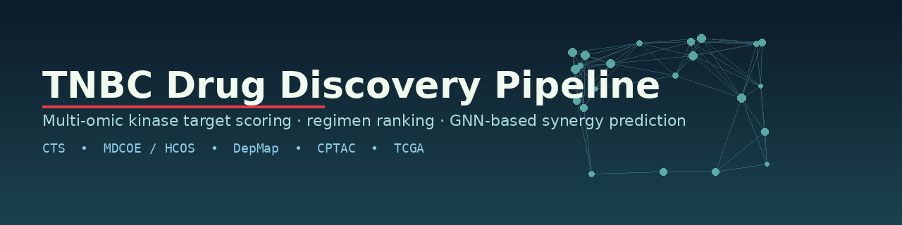
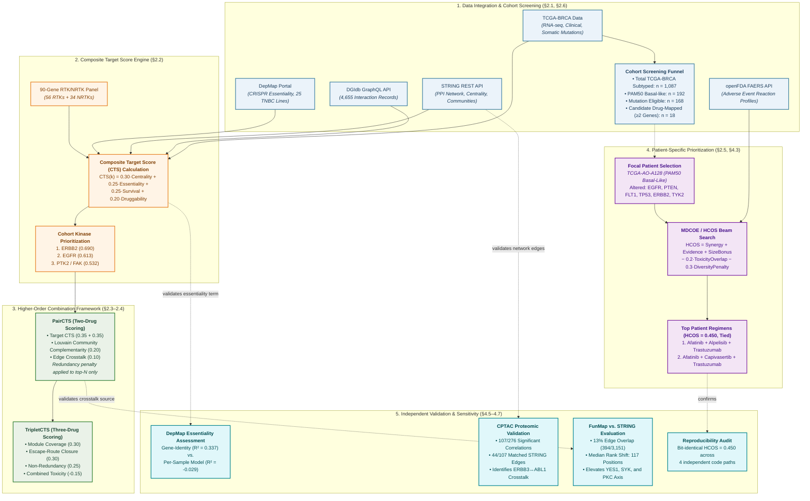

# TNBC Kinase-Redundancy, Drug-Regimen, and Cohort-Scale ML Project

[](LICENSE)
[](https://www.python.org/)
[](https://pytorch.org/)
[]()
[]()

A real-data computational pipeline for RTK/NRTK target prioritization and drug-regimen
discovery in triple-negative breast cancer. This repository consolidates our earlier
kinase-scoring and drug-regimen work into a single codebase, extended from a single
focal-patient case (TCGA-AO-A128) to four cohort-scale analysis tracks.

## Project scope

| Track | Question | Population | Status |
|---|---|---|---|
| A — Survival/prognosis | Patient-level risk prediction | Full BRCA cohort, n≈1000-1098, subtype as feature | Built and verified (`src/survival/patient_level_survival_model.py`) |
| B — Treatment response | Predict pCR/response | — | Not attempted — no response label available in this cohort; see `docs/limitations.md` |
| C — TNBC subtyping | Lehmann-style molecular subtypes | TNBC-only, n≈150-200 | Built and run on real data (1095 patients). Code correctness confirmed via synthetic ground truth, but real-cohort clustering gives consistently weak separation (silhouette 0.02-0.07) across three independently-designed methods. We interpret this as genuine TNBC subtype overlap in bulk RNA-seq rather than a code defect — see `docs/limitations.md` |
| D — Biomarker/drug-target discovery | Which kinases/regimens generalize across the cohort | TNBC-only, n≈150-200 | Built and verified end-to-end — `mdcoe.py` reproduces the HCOS = 0.450 headline result and wires into `cohort_wide_regimen_analysis.py` (see `src/regimen/README.md`) |

`src/regimen/`, `src/scoring/`, and `src/data_loaders/` contain the real source code behind
these results, not placeholders — each folder's own README states exactly what has been
verified against real data and what still requires the raw TCGA/DepMap/STRING/DGIdb files
(see `data/README.md` for where to obtain them).

## Subprojects in this repository

This repository contains several related but independently-developed efforts on TNBC
kinase redundancy and combination therapy. Each addresses a different angle, and nothing
here is cross-validated against the others except where explicitly noted in that
subproject's own docs.

- **`src/` + `data/`** — the CTS/HCOS/DepMap cohort-scale pipeline, the main focus of this
  README.
- **`tnbc-genomics-agent/`** — a self-contained, single-patient VCF-to-narrative pipeline
  (10-kinase curated database, redundancy/bypass-risk scoring, AI-assisted synthesis,
  companion report in `tnbc-genomics-agent/docs/`). Test suite passing (31/31).
- **`mc-ore-prototype/`** — a proposed extension of `tnbc-genomics-agent` (GNN synergy
  prediction, knowledge graph, multi-agent reasoning), with a runnable Phase-1 scaffold
  notebook. See `mc-ore-prototype/README.md` for a naming note (MC-ORE / Hybrid-CORE /
  CL-MODE are used across its source documents for the same concept).
- **`tnbc_regimen_pipeline/`** — an installable (v3.0.0) Python package: a matured,
  CLI-driven, provenance-stamped version of `src/regimen/` and `src/discovery/`'s scripts.
  A CLI run reproduces the headline afatinib+alpelisib+trastuzumab HCOS = 0.450 result to
  floating-point precision, and handles live-network failures (e.g. a PubMed E-utilities
  outage) by logging and excluding the affected gene rather than crashing. See
  `tnbc_regimen_pipeline/INTEGRATION_NOTES.md`.
- **`cptac-proteomics-validation/`** — real, measured CPTAC BRCA proteomics, cross-checked
  against STRING-predicted kinase crosstalk edges used in `PairCTS`/`TripletCTS`. This
  cohort is BRCA-wide rather than TNBC-restricted (151 samples) since no subtype metadata
  is available for it through the `cptac` package. See `cptac-proteomics-validation/README.md`.
- **`docs/kinase_panel_audit/`** — a cited kinase-panel audit (56 RTK + 32 NRTK = 88, vs.
  our original 54+29 = 83). This audit identified a real discrepancy: the 90-kinase panel
  used throughout this project includes `LMTK2`/`LMTK3`, which the audit recommends
  excluding — see `docs/limitations.md`.
- **`src/predictive_models/`** — GNN-based kinase-response/redundancy and drug-synergy
  prediction. The synergy component fulfills the gap `mc-ore-prototype/README.md` itself
  documents as not yet built (`SynergyModel.predict_pair()`, previously a placeholder
  interface awaiting DrugCombDB/AZ-DREAM-style training data). This module is implemented
  and synthetic-data-verified; real-data training (DrugComb, PRISM Repurposing) is in
  progress. See `src/predictive_models/README.md` for current status and known limitations
  (no biologics support yet, e.g. trastuzumab). Once this is validated on real data, we
  intend to retire `mc-ore-prototype`'s placeholder `SynergyModel` rather than maintain two
  parallel implementations.

`docs/source_repo_readmes/` preserves the original READMEs from the two GitHub repos this
project was consolidated from (`tnbc-kinase-scoring-pipeline`, `TNBC-drug-regimen-discovery`).

## Repository layout

```
tnbc-project/
├── tnbc-genomics-agent/      # separate subproject — own README + INTEGRATION_NOTES.md
├── mc-ore-prototype/          # separate subproject — proposed extension of tnbc-genomics-agent
├── tnbc_regimen_pipeline/     # separate subproject — installable package, verified end-to-end
├── src/predictive_models/     # GNN-based kinase-response and drug-synergy prediction
├── data/
│   ├── raw/            # real, externally-sourced data — see data/README.md for download
│   │                   # instructions per source (never hand-edited)
│   └── processed/      # code-generated intermediate files, regenerable from raw/
├── src/
│   ├── data_loaders/   # per-source loaders (TCGA, DepMap, STRING, DGIdb, openFDA, PubMed)
│   ├── scoring/        # CTS / PairCTS / TripletCTS
│   ├── regimen/        # MDCOE/HCOS beam search, cohort-wide regimen analysis (Track D)
│   ├── survival/       # per-kinase survival test + patient-level risk model (Track A)
│   ├── subtyping/      # TNBC molecular subtyping (Track C)
│   ├── ml/             # DepMap dependency-prediction ML investigation
│   └── discovery/      # agentic literature-mining pipeline
├── tests/              # mirrors src/, synthetic-data-with-known-structure smoke tests
├── notebooks/          # exploratory analysis
├── results/
│   ├── figures/
│   ├── tables/
│   └── reports/        # findings reports
├── docs/                # methodology, data provenance, limitations
└── scripts/             # CLI entry points wiring loaders through to src/ modules
`
```



**Legend:** 🔵 data sources · 🟠 CTS engine · 🟢 combination scoring · 🟣 patient-specific (HCOS) · 🔷 independent validation

## Getting started

**Using fish shell?** See `docs/FISH_SHELL_GUIDE.md` first — virtual environment
activation, environment variables (`ANTHROPIC_API_KEY`, `TNBC_MIN_AF`, etc.), and running
each subproject all use different syntax than bash. `scripts/setup_local_data.fish` is a
native fish port of step 1 below.

1. Run `scripts/setup_local_data.sh` (edit the paths at the top first) to copy
   already-downloaded TCGA/DepMap/STRING/DGIdb files into `data/raw/` in the expected
   layout.
2. `pip install -r requirements.txt`
3. Run the Track A smoke tests to confirm the environment is set up correctly:
   `python tests/../src/survival/patient_level_survival_model.py`
4. Wire real data into `scripts/run_track_a_survival.py` and run it.

## Principles we follow on this project

- Real data only. Synthetic data is confined to smoke tests and never contributes to a
  reported finding.
- State gaps plainly (see `docs/limitations.md`) rather than filling them with an invented
  proxy.
- Verify real file structure before trusting an assumed column name.
- Prefer convergent validation across independent methods over a single scoring approach.
